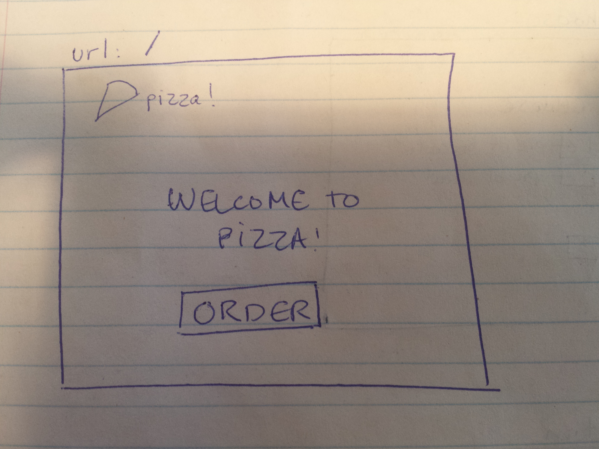
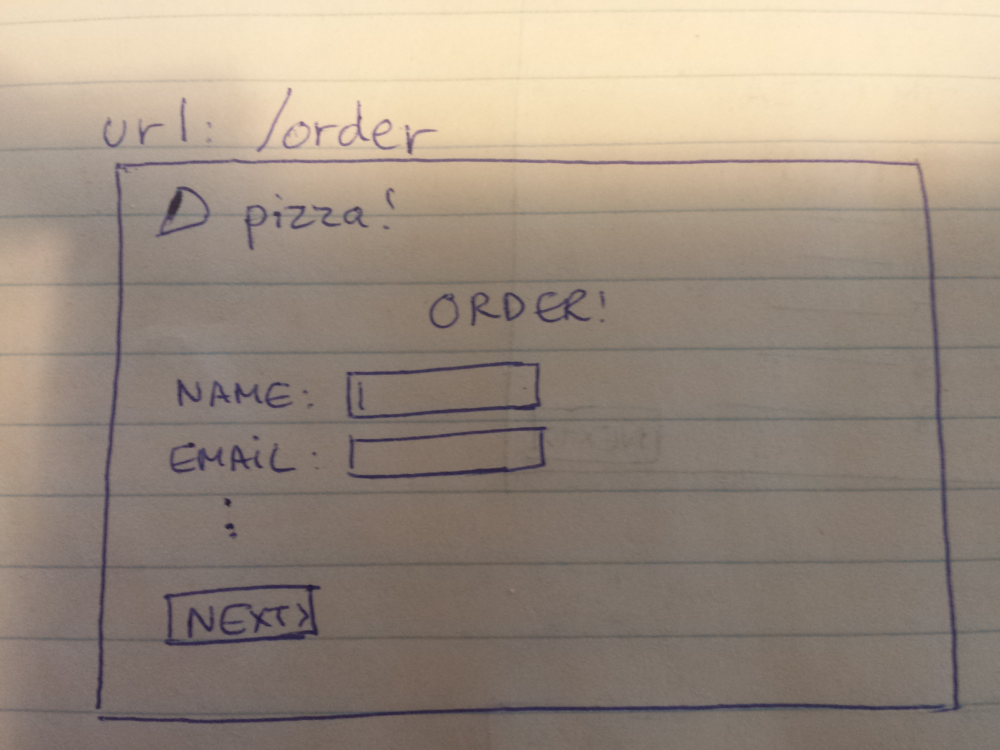

# Building a pizza ordering application with React
          

For this project, we are going to build a pizza ordering application with React. Optionally, our application will be able to communicate with the server to place the order! Unfortunately, no pizza will be had unless you make it yourself.

Before getting started with the project, please take some time to read *and* understand the following articles:

*   [Displaying data with JSX](https://facebook.github.io/react/docs/displaying-data.html)

*   [JSX in depth](https://facebook.github.io/react/docs/jsx-in-depth.html)

*   [Interactivity and dynamic UIs](https://facebook.github.io/react/docs/interactivity-and-dynamic-uis.html)

*   [Multiple components](https://facebook.github.io/react/docs/multiple-components.html)

*   [React components lifecycle](https://facebook.github.io/react/docs/component-specs.html) **!important**

*   [The React way: getting started tutorial](https://blog.risingstack.com/the-react-way-getting-started-tutorial/)

    **NOTE**: we will not be building a so-called "isomorphic" application so you may skip that part of the article.

*   [Five practical examples for learning React](http://tutorialzine.com/2014/07/5-practical-examples-for-learning-facebooks-react-framework/)

    **NOTE**: make sure to reproduce each of the five examples on your own!

    **NOTE 2**: in the last example, the tutorial uses jQuery to do AJAX. Try to do it with [`isomorphic-fetch`](https://github.com/matthew-andrews/isomorphic-fetch)

*   [Introduction to `react-router`](https://github.com/reactjs/react-router/blob/master/docs/Introduction.md)

    **NOTE**: routing is a concept you are already familiar with, but on the server side.

    As far as we are concerned, routing is the process of deciding what to display based on the current URL.

    On the server side, we are using the Express library to help us do our routing. For example, we tell Express that we want to handle **`GET`** requests to `/content/:id`. When a request comes along for this URL, Express knows which function to call.

    Routing in the browser is similar: we already saw that we could induce a change of the URL in the browser without refreshing the page, by using the [History API](https://developer.mozilla.org/en-US/docs/Web/API/History_API) provided by the browser. Similarly, [we can get notified when the URL changes](https://developer.mozilla.org/en-US/docs/Web/API/WindowEventHandlers/onpopstate) due to the back or forward buttons being clicked.

    If we put these two concepts together, we can write JavaScript code for the browser that can decide what to display based on the current URL. We can do it manually, but `react-router` does it for us :)

* [React router: a comprehensive introduction](https://www.themarketingtechnologist.co/react-router-an-introduction/)

## Base structure
Our application will be built to run in the browser. This means we will not be needing our own server nor database. However, **we need to serve our files somewhere**. For this reason, a tiny web server was created at `server.js`. All you have to do is run it with `node server.js`. You should not need to restart it nor modify it.

This repository already contains a base structure to get you started:

* `src`: Source directory that contains all your HTML, CSS and JavaScript code
* `src/index.html`: This will load our application. Since it's an all front-end app, everything happens in here :)
* `src/js`: Will contain your JavaScript code
* `src/css`: Your stylesheet
* `.babelrc`: tells Babel what to transform. In our case, it will transform JSX to React calls, and ES6 to "regular JavaScript"
* `.gitignore`: tells Git to ignore some files. `node_modules` can be installed with NPM
* `package.json`: contains the project dependencies as well as some scripts that we can `npm run`
* `README.md`: This file ;)
* `server.js`: Runs a tiny web server that always sends `index.html` by default
* `webpack.config.js`: Configuration for Webpack

To start hacking on this project:

1. `npm install`
2. Start the server with `node server.js`
3. Start Webpack with `webpack --watch`
4. Start coding!

## App specification
This is a tiny specification of the app you will be building:

### Routes
The app will have the following routes:
  *   `/`

    Welcome page. On this page, you should welcome the user to your Pizza place and have a link to `/order`
    
    

  *   `/order`

    Order creation page. On this page, you will have a form for the user to enter their name, email, phone number and home address (street address, city, province and postal code). A "Next" button will be displayed. Upon clicking on "Next", you should remember the user's address somewhere and move to the next step
    
    

  *   `/choose`

    Pizza choosing page. On this page, the user will be able to choose among a variety of pizzas. You will present a list of pre-made pizzas for the user to choose from, as well as a "custom pizza" option.
    
    

  *   `/custom`

    If the user chooses the "custom pizza" option, they wil get to this page. Here they will be presented with a list of toppings to choose from, as well as a list of cheeses. **More on that later**
    
    

  * `/done`

    The order confirmation page. If the user chooses a pre-made pizza or finishes their custom pizza, they will get to this page. This page will display the order confirmation, which consists of the user's name, address, their choice of pizza and the price. **More on the price later**
    
    

### Cheeses
The cheeses will be an array of cheese objects like so:

```javascript
var cheeses = [
  {
    name: 'mozzarella',
    displayName: 'Mozzarella cheese'
    price: 0
  },
  {
    name: 'parmesan',
    displayName: 'Parmigiano Reggiano',
    price: 100
  }
];
```

You are welcome to add as many cheeses as you like, and to provide pictures as well :)

### Toppings
The toppings will be an array of topping objects like so:

```javascript
var toppings = [
  {
    name: 'pepperoni',
    displayName: 'Pepperoni',
    price: 1
  },
  {
    name: 'anchovies',
    displayName: 'Anchovies',
    price: 10
  },
  {
    name: 'lobster',
    displayName: 'Lobstah',
    price: 25
  }
  {
    name: 'truffle oil',
    displayName: 'Mmmm... truffle oillll',
    price: 100
  }
];
```

You are welcome to add as many toppings as you like, and to provide pictures as well :)

### Pizzas
The pizzas will be an array of pizza objects. Each pizza object is made up of one cheese choice, as many toppings as desired, a name and a price. The array of toppings will use the topping `name` field as a "unique ID":

```javascript
var pizzas = [
  {
    name: 'Cheese Pizza',
    cheese: 'mozzarella',
    toppings: [],
    price: 5
  },
  {
    name: 'The Monster',
    cheese: 'parmesan',
    toppings: ['anchovies', 'lobster', 'truffle oil'],
    price: 100
  }
];
```

You are welcome to add as many pizzas as you like, and to provide pictures as well :)

### Custom pizzas!
The custom pizza creation screen will present the user with a list of all the toppings available, their price and optionally a picture. The different cheese choices will be presented as well, along with their price and optional picture. For both toppings and cheeses, the `displayName` property should be used.

The screen will also present the user with the total price of the pizza. This is calculated as a base price of $10, plus the prices of any toppings they choose.

The user will be able to choose **up to four toppings** for their pizza. Whenever they change the topping choices, the price will change to reflect it.

Once the user is happy, they can click on "Next" to be taken to the order confirmation page.

### Order confirmation
On the order confirmation page, the following information will be displayed:

1. The user's name, phone number, email and home address
2. The name of the pizza they chose, or "Custom pizza"
3. A list of toppings on their pizza
4. The final price for their order

## Optional: link the app to a server!
With some AJAX code, link your app to an API that can return the following data (probably as JSON):

1. List of cheeses
2. List of toppings
3. List of pre-made pizzas

On the order confirmation page, add an "Order Now" button. Clicking this button will send the order to the server with AJAX. The server should send back a JSON response with a unique order ID. Upon receiving the server response, your code should use the order ID to take the user to a new `/orders/:id` page.

On the "order page", you should ask the user to provide their e-mail address to confirm they are the owner of that order. Through AJAX, send the user's email and orderId to the server. On the server side, if the email corresponds to the orderId, send back a JSON response with the order data. On the browser side, display the order data to the user on that same page.
